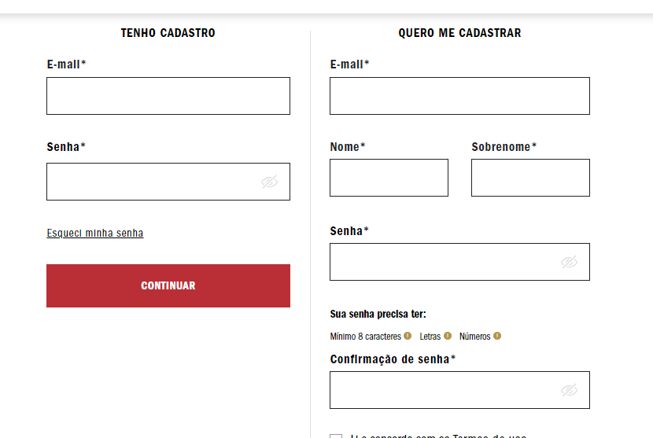

# form-CadEcommerce

## `1º Site: Vans`
Campos identificados no cadastro desse site: 

### `Primeira aba:` 
* Email 
* Nome e sobrenome
* Senha e confirmação de senha.
### `Segunda aba:`
* CPF 
* Telefone e data de nascimento.
### `Terceira aba:` 
* Identificação de endereço, 
* CEP
* Endereço
* Número
* Complemento
* Bairro
* Referência
* Cidade
* Estado
* Nome do destinatário
* Telefone do destinatário.

 
## `2º Site: Adidas` 
Campos identificados no cadastro desse site:

Primeira aba: Email e senha.
 Segunda aba: nome e sobrenome, CPF, endereço, CEP, número, informações adicionais, bairro, cidade, estado.

 
## `3º Site: Dc shoes`
Campos identificados no cadastro desse site:

Primeira aba: nome completo, CPF, data de nascimento, telefone de contato fixo e celular, sexo, Email, senha e confirmação de senha. 
Segunda aba: CEP, número, complemento, referência, identificação, nome do destinatário 
