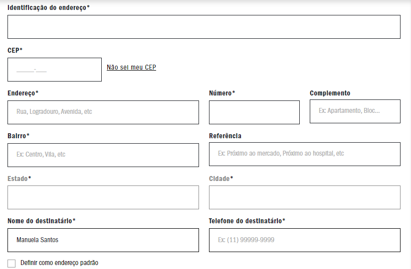
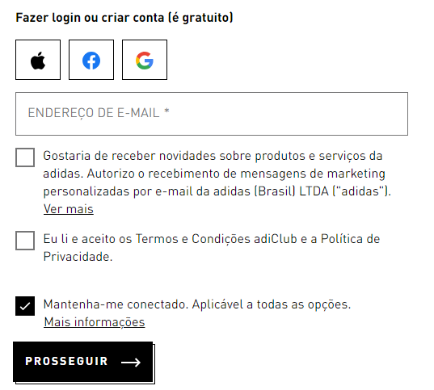
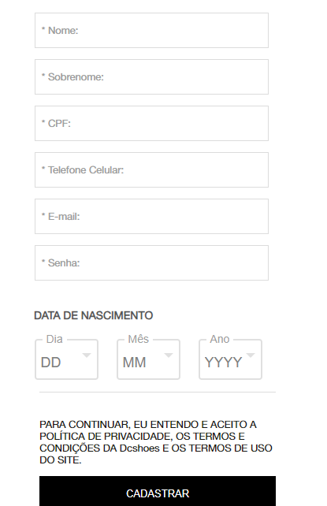

# form-CadEcommerce

## `1º Site: Vans`
Campos identificados no cadastro desse site: 

### `Primeira aba:` 
* Email 
* Nome e sobrenome
* Senha e confirmação de senha.
### `Segunda aba:`
* CPF 
* Telefone e data de nascimento.
### `Terceira aba:` 
* Identificação de endereço, 
* CEP
* Endereço
* Número
* Complemento
* Bairro
* Referência
* Cidade
* Estado
* Nome do destinatário
* Telefone do destinatário.

 
## `2º Site: Adidas` 
Campos identificados no cadastro desse site:

### `Primeira aba`
* Email 
* senha
### `Segunda aba`
* Nome 
* Sobrenome
* CPF
* Endereço 
* CEP
* Número
* Informações adicionais
* Bairro
* Cidade
* Estado.

 
 

 
## `3º Site: Dc shoes`
Campos identificados no cadastro desse site:

### `Primeira aba:`
 * Nome completo
 * CPF
 * Data de nascimento
 * Telefone de contato fixo e celular
 * Sexo
 * Email
 * Senha 
 * Confirmação de senha. 
### `Segunda aba`
* CEP
* Número
* Complemento
* Referência
* Identificação
* Nome do destinatário 

